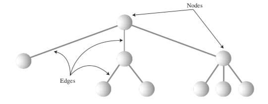

# Binary Trees

### Edges and Nodes:

### More Tree terms:

### Unbalanced Tree:

### Tree Logic:

### Traversing the Tree:

## Nodes
* First node added to tree is root
* A node is either a left or right child of the parent node (Unless it is the root node)
* A node with no children is called a leaf
* Nodes are objects
* Create objects leftChild and rightChild of type node
* Links connecting nodes are called edges

## Tree
* Trees are also objects
* Need find(), insert(), and delete() methods

## Efficiency
* O(logN) if balanced
* Can get as abad as O(N) if unbalanced

## Tree Traversal

### InOrder Traversal
* Goes left until it hits a null, then works its way right
* Finds nodes in oreder of lowest to highest

### Minimum and Maximum Nodes
* Find minimum by going left until getting null
* Find maximum by going right until getting null

