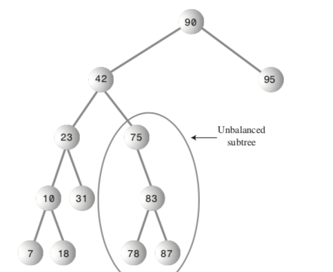
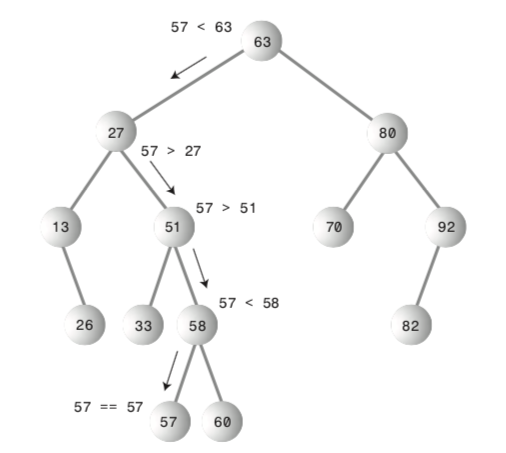

# Binary Trees

## Nodes
* First node added to tree is root
* A node is either a left or right child of the parent node (Unless it is the root node)
* A node with no children is called a leaf
* Nodes are objects
* Create objects leftChild and rightChild of type node
* Links connecting nodes are called edges

### Edges and Nodes:

## Tree
* Trees are also objects
* Need find(), insert(), and delete() methods

### More Tree terms:

## Efficiency
* O(logN) if balanced
* Can get as abad as O(N) if unbalanced

### Unbalanced Tree:

## Tree Traversal

### InOrder Traversal
* Goes left until it hits a null, then works its way right
* Finds nodes in oreder of lowest to highest

### Minimum and Maximum Nodes
* Find minimum by going left until getting null
* Find maximum by going right until getting null

## Deleting a Node
* Deleting leaves is easy
* Deleting a node with one child
    * Delete the node
    * Move its child up to its position
    * Move all children below that up a level
* Deleting a node with two children
        * Go left
        * Go right repeatedly until reaching a leaf
    * OR
        * Go right
        * Go left repeatedly until reaching a leaf
    * THEN
    * Move selected node to deleted position

## Trees Represented as Arrays
* Value at index 0 is root node
* Value at index 1 is root's left child
* So on, going left to right for each level of the array
* Leave blank values for nonexistent children
* Need methods to find a given node's parent, left child, right child

### Tree Logic:

### Traversing the Tree:

## Nodes
* First node added to tree is root
* A node is either a left or right child of the parent node (Unless it is the root node)
* A node with no children is called a leaf
* Nodes are objects
* Create objects leftChild and rightChild of type node
* Links connecting nodes are called edges

## Tree
* Trees are also objects
* Need find(), insert(), and delete() methods

## Efficiency
* O(logN) if balanced
* Can get as abad as O(N) if unbalanced

## Tree Traversal

### InOrder Traversal
* Goes left until it hits a null, then works its way right
* Finds nodes in oreder of lowest to highest

### Minimum and Maximum Nodes
* Find minimum by going left until getting null
* Find maximum by going right until getting null

